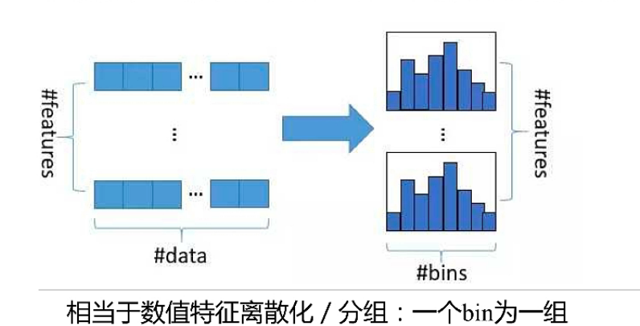
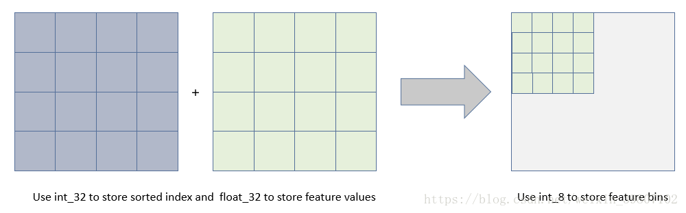
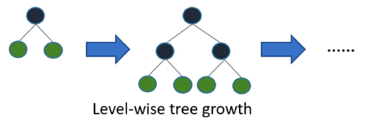
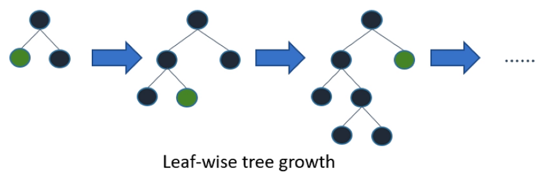
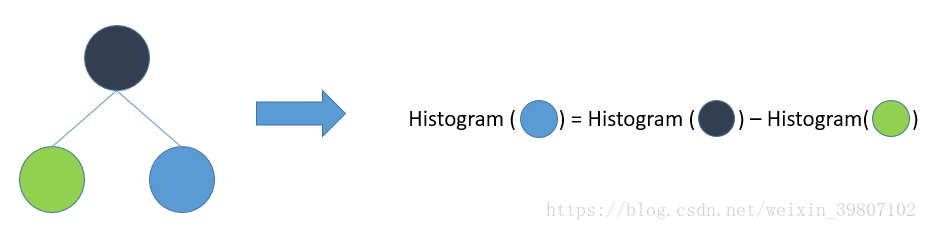
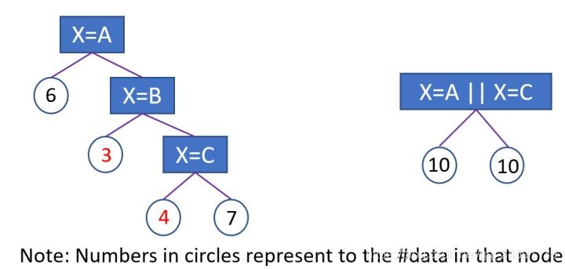
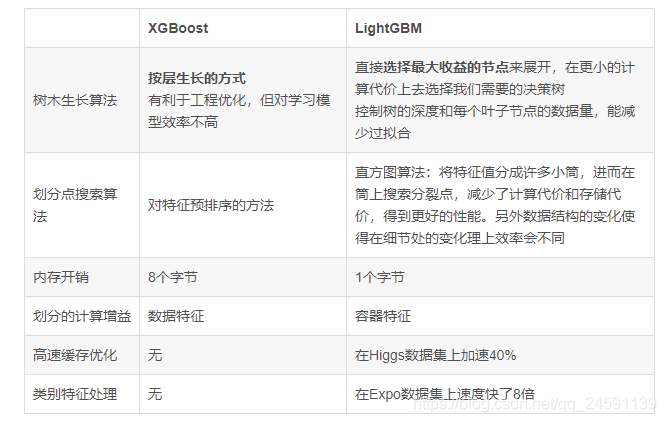

# machine_learning
all about machine learing,such as knn, tf-idf,k-means,etc.


# tf-idf 详解
TF-IDF是一种统计方法，用以评估一字词对于一个文件集或一个语料库中的其中一份文件的重要程度。字词的重要性随着它在文件中出现的次数成正比增加，但同时会随着它在语料库中出现的频率成反比下降。
## TF是词频
词频（TF）：表示词条（关键字）在文本中出现的频率。
这个数字通常会被归一化(一般是词频除以文章总词数), 以防止它偏向长的文件。


$$ TF_w = \frac{在某一类中词条w出现的次数}{该类目中所有的词条数目} $$
$$ tf_{ij} = \frac{n_{i,j}}{\sum_{k} n_{k,j} }$$
其中$n_{i,j}$ 是该词在文件$d_j$中出现的次数，分母则是文件$d_j$中所有词汇出现的次数总和；

##  IDF
逆向文件频率 (IDF) ：某一特定词语的IDF，可以由总文件数目除以包含该词语的文件的数目，再将得到的商取对数得到。
如果包含词条t的文档越少, IDF越大，则说明词条具有很好的类别区分能力。
$$ IDF = log(\frac{语料库的文档总数}{包含词条w的文档数 + 1})$$
分母之所以加1，是为了避免分母为0
## TF-IDF
$$ tf-idf = TF * IDF $$
## TF-IDF应用
- 搜索引擎
- 关键词提取
- 文本相似性
- 文本摘要


# LightGBM 算法原理
## LightGBM 优化部分包含以下：
+ 基于 Histogram 的决策树算法
+ 带深度限制的 Leaf-wise 的叶子生长策略
+ 直方图做差加速
+ 直接支持类别特征
+ Cache 命中率优化
+ 基于直方图的稀疏特征优化
+ 多线程优化

### Histogram 算法
直方图算法的基本思想是先把连续的浮点特征值离散化成k个整数，同时构造一个宽度为k的直方图。在遍历数据的时候，根据离散化后的值作为索引在直方图中累积统计量，当遍历一次数据后，直方图累积了需要的统计量，然后根据直方图的离散值，遍历寻找最优的分割点。

```
注：直方图算法是指将样本点离散化成n人箱子，分裂时，整个箱子一起分裂，即整个箱子在左边，
或在右边；XGBoost的近似搜索也类似，但其用的是不直方图，而是分位数；
```
使用直方图算法有很多优点。首先，最明显就是内存消耗的降低，直方图算法不仅不需要额外存储预排序的结果，而且可以只保存特征离散化后的值，而这个值一般用 8 位整型存储就足够了，内存消耗可以降低为原来的1/8


然后在计算上的代价也大幅降低，预排序算法每遍历一个特征值就需要计算一次分裂的增益，而直方图算法只需要计算k次（k可以认为是常数），时间复杂度从 O(#data#feature)优化到O(k#features)

当然，Histogram 算法并不是完美的。由于特征被离散化后，找到的并不是很精确的分割点，所以会对结果产生影响。但在不同的数据集上的结果表明，离散化的分割点对最终的精度影响并不是很大，甚至有时候会更好一点。

```
原因是决策树本来就是弱模型，分割点是不是精确并不是太重要；较粗的分割点也有正则化的效果，
可以有效地防止过拟合；即使单棵树的训练误差比精确分割的算法稍大，但在梯度提升
（Gradient Boosting）的框架下没有太大的影响。  
```
### 带深度限制的 Leaf-wise 的叶子生长策略
在 Histogram 算法之上，LightGBM 进行进一步的优化。首先它抛弃了大多数 GBDT 工具使用的按层生长 (level-wise) 的决策树生长策略，而使用了带有深度限制的按叶子生长 (leaf-wise) 算法。Level-wise 过一次数据可以同时分裂同一层的叶子，容易进行多线程优化，也好控制模型复杂度，不容易过拟合。但实际上 Level-wise 是一种低效的算法，因为它不加区分的对待同一层的叶子，带来了很多没必要的开销，因为实际上很多叶子的分裂增益较低，没必要进行搜索和分裂。

```
注：level-wise(XGBoost采用的方式)是指分裂时按树的层数分裂出一个完整的决策树，
如分裂的第一层为2个，第二层为4个，第三层为8个.......，第n层为2^n个；

leaf-wise(LightGBM采用的方式)每次从当前所有叶子中，找到分裂增益最大
(一般也是数据量最大)的叶子节点进行分裂。
```


Leaf-wise 则是一种更为高效的策略，每次从当前所有叶子中，找到分裂增益最大的一个叶子，然后分裂，如此循环。因此同 Level-wise 相比，在分裂次数相同的情况下，Leaf-wise 可以降低更多的误差，得到更好的精度。Leaf-wise 的缺点是可能会长出比较深的决策树，产生过拟合。因此 LightGBM 在 Leaf-wise 之上增加了一个最大深度的限制，在保证高效率的同时防止过拟合。


```
注：leaf-wise分裂完成的有可能不是一棵完全树，且每次分裂时，都会忽略层数，
从当前所有的叶子节点里进行筛选，如上图中第二个箭头右边的图里，筛选的叶子节点为，
第三层的第一个，第四层的第一个和第二个，第二层的第二个；
```

### 直方图加速
LightGBM 另一个优化是 Histogram（直方图）做差加速。一个容易观察到的现象：一个叶子的直方图可以由它的父亲节点的直方图与它兄弟的直方图做差得到。通常构造直方图，需要遍历该叶子上的所有数据，但直方图做差仅需遍历直方图的k个桶。利用这个方法，LightGBM 可以在构造一个叶子的直方图后，可以用非常微小的代价得到它兄弟叶子的直方图，在速度上可以提升一倍。


```
注：histogram做差加速是指，因为分裂后的左节点和右节点的样本数等于其父节点的样本数，
 所以父节点分裂时，左叶子节点分裂完后，右叶子节点里的样本不需要再次计算，
 而是直接用父节点的样本减去左叶子节点里的样本得到；
```
### 直接支持类别特征
实际上大多数机器学习工具都无法直接支持类别特征，一般需要把类别特征，转化到多维的0/1 特征，降低了空间和时间的效率。而类别特征的使用是在实践中很常用的。基于这个考虑，LightGBM 优化了对类别特征的支持，可以直接输入类别特征，不需要额外的0/1 展开。并在决策树算法上增加了类别特征的决策规则。

**详细流程**
1.离散特征建立直方图的过程
统计该特征下每一种**离散值出现的次数，并从高到低排序**并过滤掉出现次数较少的特征值, 然后为每一个特征值，建立一个bin容器, 对于在bin容器内出现次数较少的特征值直接过滤掉，不建立bin容器。
2.计算分裂阈值的过程:
2.1 先看该特征下划分出的bin容器的个数，如果bin容器的数量小于4，直接使用one vs other方式, 逐个扫描每一个bin容器，找出最佳分裂点;
2.2 对于bin容器较多的情况, 先进行过滤，只让子集合较大的bin容器参加划分阈值计算, 对每一个符合条件的bin容器进行公式计算(公式如下: 该bin容器下所有样本的一阶梯度之和 / 该bin容器下所有样本的二阶梯度之和 + 正则项(参数cat_smooth)，这里为什么不是label的均值呢？其实上例中只是为了便于理解，只针对了学习一棵树且是回归问题的情况， 这时候一阶导数是Y, 二阶导数是1)，得到一个值，根据该值对bin容器从小到大进行排序，然后分从左到右、从右到左进行搜索，得到最优分裂阈值。但是有一点，没有搜索所有的bin容器，而是设定了一个搜索bin容器数量的上限值，程序中设定是32，即参数max_num_cat。
LightGBM中对离散特征实行的是many vs many 策略，这32个bin中最优划分的阈值的左边或者右边所有的bin容器就是一个many集合，而其他的bin容器就是另一个many集合。
### XGBoost与LightGBM对比



# 参考文献
1. [LightGBM 算法原理](https://my.oschina.net/sunmin/blog/3041224)